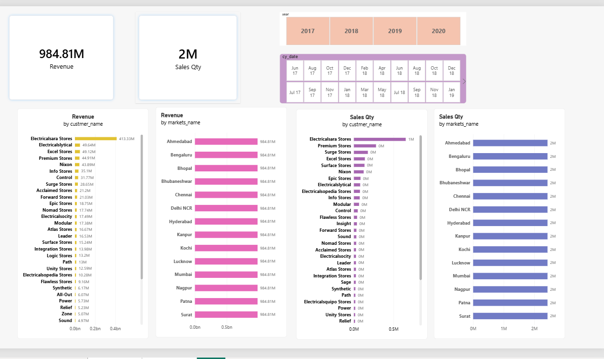

# 📊 AtliQ Hardware Sales Insights Dashboard

An end-to-end data analytics project built to transition **AtliQ Hardware** from gut-feeling, verbal sales reporting to automated, data-driven decision making. 

## 🎯 Business Scenario & Challenge
AtliQ Hardware is a major computer hardware manufacturer supplying retail giants across India (e.g., Excel Stores). The Sales Director, **Bhavin Patel**, was heavily frustrated by:
*   **Lack of Visibility:** Over-reliance on qualitative, sugarcoated phone updates from regional managers.
*   **Data Bloat:** Being buried under 60+ unorganized Excel sheets containing thousands of rows.
*   **Declining Market Share:** Inability to pinpoint exactly *which* regions or products were pulling down overall revenue.

### The Solution
Developed an automated **Power BI Dashboard** connected to a **MySQL database** that distills complex sales metrics into clear, actionable charts—saving hours of reporting and revealing immediate growth opportunities.

---

## 🛠️ Tech Stack & Skills Demonstrated
*   **Database Management:** MySQL (Data Discovery, Join operations, Aggregations)
*   **ETL & Data Transformation:** Power Query (Data cleaning, filtering garbage values, currency normalization)
*   **Data Modeling:** Star Schema design (Fact and Dimension tables)
*   **Data Visualization & Analytics:** Power BI, DAX (Dynamic measures, KPI cards, YoY trends)

---

## 📐 Project Framework: The AIMS Grid
Before writing any code, I used the **AIMS Grid** to define the strategic scope:
1.  **Purpose:** Unlock hidden sales insights for automated performance tracking.
2.  **Stakeholders:** Sales Director, Marketing Head, Regional Analytics Team.
3.  **End Result:** A centralized dashboard providing automated insights to support strategic planning.
4.  **Success Criteria:** Dashboards that immediately highlight underperforming regions to deploy target promotion campaigns.

---

## 📊 Dashboard Visual Preview


### Key Metrics Tracked:
*   **Revenue vs. Sales Quantity:** Dynamic gauge counters showing business scale.
*   **Top 5 Customers & Products:** Instant filters identifying the highest-value accounts.
*   **Revenue Breakdown by Market:** Geographic bar charts illustrating Delhi NCR vs. Mumbai vs. Ahmedabad performance.

---

## 🧼 Data Transformation (Power Query & DAX Showcase)
During the **Data Cleaning** phase, I resolved crucial structural data issues:
*   **Currency Standardization:** Converting transactions recorded in USD to INR to prevent skewed revenue results.
*   **DAX Formula Used for Revenue:**
    ```dax
    Revenue = SUMX(
        FILTER(transactions, transactions[sales_amount] > 0), 
        IF(transactions[currency] == "USD", transactions[sales_amount] * 75, transactions[sales_amount])
    )
    ```
*   **Data Filtering:** Removed transactions with negative or zero amounts which represented corrupt system logging.

---

## 💡 Business Impact & Key Actions Enabled
1.  **Eliminated Guesswork:** The Sales Director now has a singular "source of truth", bypassing biased manager summaries.
2.  **Targeted Interventions:** Identified that the **Central Region** was facing the steepest decline, enabling the marketing team to deploy localized discount coupons immediately.
3.  **Automated Reporting:** Enabled scheduled monthly email snapshots via Power BI Service, saving hours of manual assembly.